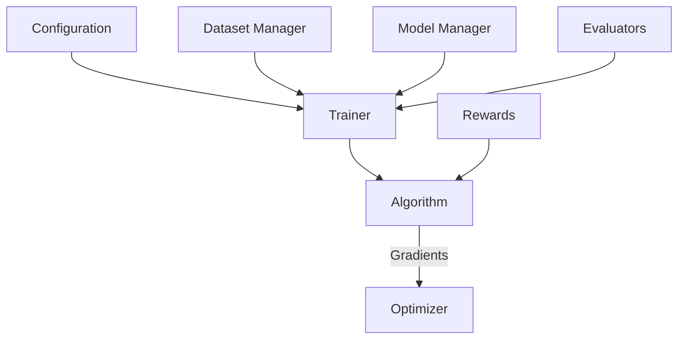
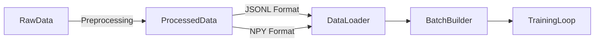
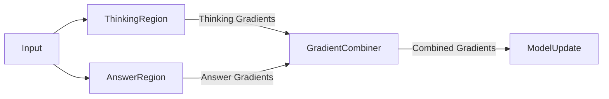

# MLX RL Trainer: Production-Scale Architecture

A highly modular, production-grade Reinforcement Learning (RL) trainer for MLX-based language models, designed from the ground up with best software engineering practices.

[](https://github.com/yourusername/mlx_rl_trainer)
[](https://opensource.org/licenses/MIT)
[](https://www.python.org/downloads/)
[](https://github.com/ml-explore/mlx)

## Table of Contents

- [Overview](#overview)
- [Core Architectural Principles](#core-architectural-principles)
- [System Architecture](#system-architecture)
- [Installation](#installation)
- [Quick Start](#quick-start)
- [Configuration](#configuration)
- [Dataset Format](#dataset-format)
- [Reward System](#reward-system)
- [GRPO Algorithm](#grpo-algorithm)
  - [Dual Gradient System](#dual-gradient-system)
  - [SFT Modes](#sft-modes)
  - [Mathematical Formulation](#mathematical-formulation)
- [Advanced Usage](#advanced-usage)
- [Contributing](#contributing)
- [License](#license)

## Overview

MLX RL Trainer is a framework for training language models using reinforcement learning techniques, specifically designed for Apple's MLX framework. It implements the Generalized Reinforcement from Policy Optimization (GRPO) algorithm with advanced features like dual gradient handling, supervised fine-tuning (SFT), and a pluggable reward system.

Key features:
- **Modular Architecture**: Easily extensible with new algorithms, rewards, and evaluators
- **Dual Gradient System**: Separate gradient computation for thinking and answer regions
- **Pluggable Rewards**: Registry pattern for adding custom reward functions
- **Efficient Data Pipeline**: Supports both JSONL and pre-tokenized NPY formats
- **Comprehensive Monitoring**: Rich logging and visualization capabilities
- **Production-Ready**: Robust error handling, checkpointing, and evaluation

## Core Architectural Principles

The framework is built on several core architectural pillars:

- **SOLID & OOP:** Every component is designed with Single Responsibility, Open/Closed principles, and Dependency Injection in mind, using Abstract Base Classes (ABCs) to define clear contracts. This ensures code is testable, maintainable, and extensible.

- **Meta-Programming (Registry Pattern):** Reward functions and evaluators are pluggable components. They can be added to the system without modifying any core training code, simply by decorating the class and updating a YAML configuration file. This adheres to the Open/Closed Principle.

- **Predictable Code (Pydantic):** All configurations are rigorously validated through Pydantic schemas, ensuring type safety, data integrity, and preventing runtime errors stemming from malformed or incomplete configurations. This makes the system robust and easy to reason about.

- **Efficient I/O (Asyncio & Aiofiles):** The data pipeline leverages Python's `asyncio` framework in conjunction with `aiofiles` for non-blocking asynchronous file operations. This is crucial for handling large datasets efficiently without blocking the event loop.

- **Safe & Isolated Execution (Multiprocessing):** The `code_execution` reward function uses Python's `multiprocessing` library (specifically the `spawn` context) to run untrusted code in a separate, isolated process with strict timeouts. This prevents the main training loop from crashing and ensures system stability.

- **Robustness (Custom Exceptions):** A hierarchy of custom, domain-specific exceptions is used throughout the codebase for predictable, granular error handling. This allows for precise error management and recovery strategies.

- **Developer-Friendly (Tqdm & Rich Logging):** Integrated `tqdm` for clear progress bars in CLI and `rich` for enhanced, structured, and colorful logging output, improving developer experience and debugging.

## System Architecture

The system is organized into several key components that work together to provide a complete RL training pipeline:



### Project Structure

```
mlx_rl_trainer/
├── configs/                # Configuration files (YAML)
├── docs/                   # Project documentation
├── scripts/                # Entry-point scripts
├── src/
│   └── mlx_rl_trainer/
│       ├── core/           # Core abstractions: config, trainer interface, managers
│       ├── algorithms/     # RL algorithm implementations (e.g., GRPO, PPO)
│       ├── data/           # Data loading, processing, batching
│       ├── evaluation/     # Benchmark evaluators
│       ├── generation/     # Text generation utilities
│       ├── monitoring/     # Logging, metrics, W&B integration
│       ├── rewards/        # Pluggable reward functions (meta-programming)
│       └── utils/          # General utilities, logging setup
└── tests/                  # Unit and integration tests
```

### Component Interactions

The system follows a modular design where components interact through well-defined interfaces:

1. **Configuration**: Pydantic models validate and parse YAML configuration files
2. **Dataset Manager**: Loads and processes data from JSONL or NPY files
3. **Model Manager**: Handles model loading, saving, and parameter management
4. **Trainer**: Orchestrates the training process and evaluation
5. **Algorithm**: Implements the RL algorithm (e.g., GRPO)
6. **Rewards**: Pluggable components that compute rewards for generated text
7. **Evaluators**: Measure model performance on benchmark tasks

## Installation

### Prerequisites

- Python 3.9+
- MLX 0.5.0+
- MLX-LM 0.8.0+

### Installation Steps

1. Clone the repository:
   ```bash
   git clone https://github.com/yourusername/mlx_rl_trainer.git
   cd mlx_rl_trainer
   ```

2. Install the package in editable mode with development dependencies:
   ```bash
   pip install -e .[dev]
   ```

### Dependencies

The core dependencies are:
- `mlx>=0.5.0`: Apple's machine learning framework
- `mlx-lm>=0.8.0`: Language model utilities for MLX
- `pydantic>=2.0`: Data validation and settings management
- `numpy>=1.24.0`: Numerical computing
- `datasets>=2.14.0`: HuggingFace datasets library
- `pyyaml>=6.0`: YAML parsing for configuration files
- `rich>=13.0.0`: Enhanced terminal output
- `tqdm>=4.60.0`: Progress bars
- `aiofiles>=22.0.0`: Asynchronous file I/O
- `scikit-learn>=1.3.0`: For TF-IDF in reward functions

Development dependencies:
- `pandas`: For metrics plotting
- `matplotlib`: For metrics visualization
- `pytest`: For unit and integration testing
- `pytest-asyncio`: For testing async code

## Quick Start

This project is designed to be immediately runnable even without a full MLX-LM model. The `ModelManager` and `DatasetManager` include mock implementations that adhere to the defined interfaces.

### Configuration Generation

Generate a default configuration file with optimized values:

```bash
mlx-generate-config --model-path ./models/my_model --data-path ./data/train.jsonl --output config.yaml
```

The configuration generator supports three templates:
- **minimal**: Basic configuration with essential settings
- **standard**: Balanced configuration with common features (default)
- **advanced**: Full-featured configuration with all optimizations

```bash
# Generate a minimal configuration
mlx-generate-config --model-path ./models/my_model --data-path ./data/train.jsonl --template minimal

# Generate an advanced configuration
mlx-generate-config --model-path ./models/my_model --data-path ./data/train.jsonl --template advanced
```

### Training

Run the training script with a configuration file:

```bash
mlx-train --config configs/experiments/code_gen_base.yaml --log-level INFO
```

The script will automatically create dummy model and data files for the initial run. Observe the rich logging output, progress bars, and the simulated training loop.

### Evaluation

Evaluate a trained model on benchmark tasks:

```bash
mlx-evaluate --config configs/experiments/code_gen_base.yaml --checkpoint outputs/run_001/checkpoint_step_1000 --benchmark human_eval gsm8k
```

### Data Preprocessing

Preprocess raw data into the format expected by the trainer:

```bash
mlx-preprocess --config configs/experiments/code_gen_base.yaml --output-train-path data/train.json --output-val-path data/val.json
```

## Configuration

The system is configured through YAML files that define all aspects of the training process. Here's an example configuration:

```yaml
# Production-ready configuration for a code generation task using GRPO.
# Scenario: 4B model (full fine-tuning) on a 10k sample dataset, targeting verbosity.

trainer:
  algorithm: "grpo"
  output_dir: "./outputs/full_finetune_run_01" # New directory for a fresh start

  # Adjusted for a 10k dataset and an effective batch size of 8.
  # This will run for approximately two epochs.
  num_training_steps: 2500

  # --- Optimizer & Scheduler (Tuned for stable full fine-tuning) ---
  learning_rate: 1e-5 # ⭐ CRITICAL: Very low LR is essential for stable full fine-tuning.
  optimizer_beta1: 0.9
  optimizer_beta2: 0.95
  optimizer_weight_decay: 0.01

  lr_schedule_config:
    name: "cosine_decay"
    arguments: [1e-5, 1000, 1e-6] # Decay from peak to end over (2500-1500) steps
    warmup: 250 # A long warmup is crucial for stability.

  # --- Batching & Algorithm ---
  ppo_batch_size: 1
  num_rollout_samples: 1
  grad_accum_steps: 8 # Effective batch size of 8, keeps memory low but ensures stable updates.
  grpo_beta: 0.0015
  seed: -1

  # --- Dual Gradients ---
  use_dual_gradients: true
  thinking_layer_start: 18
  thinking_layer_end: 30
  answer_layer_start: 24
  answer_layer_end: 32
  answer_gradient_weight: 2.5

  # --- SFT ---
  use_sft_on_answer: true
  sft_mode: "exclude_thinking"

model:
  model_path: "/path/to/model"
  ref_model_path: "/path/to/reference/model"
  use_lora: false

generation:
  # Tag definitions
  think_start_tag: "<think>"
  think_end_tag: "</think>"

  # Biases for structural guidance
  bias_close_think: -2.0
  bias_answer_start: 6.0
  punish_extra_think_end: -12.0
  min_think_tokens: 16
  think_end_early_bias: 12.0

data:
  train_path: "/path/to/train.jsonl"
  max_prompt_len: 150
  max_gen_len: 128
  loader_type: "jsonl"
  shuffle_data: true

rewards:
  - name: "format_structure"
    weight: 0.05
    config:
      min_think_length: 10
      min_answer_length: 2
      think_length_target_min: 40
      think_length_target_max: 90

  - name: "thinking_quality"
    weight: 0.2
    config:
      target_length_min: 40
      target_length_max: 90
      excessive_length_threshold: 120

  - name: "answer_quality"
    weight: 0.1
    config:
      max_penalty: 1.0
      phrase_penalty: 0.25

  - name: "semantic_similarity"
    weight: 0.65
    config:
      method: "tfidf"
      min_length: 10
      apply_length_penalty: false
      apply_verbosity_penalty: false
      verbosity_penalty_strength: 0.01

monitoring:
  log_samples_every: 1
  max_logged_samples: 50
  use_wandb: true
  wandb_project: "mlx-grpo-project"
  log_prompts: true

checkpointing:
  checkpoint_dir: "checkpoints"
  save_every: 500
  keep_last_n: 3
  save_optimizer_state: false
```

### Key Configuration Sections

- **trainer**: Algorithm selection, hyperparameters, and training settings
- **model**: Model paths and configuration
- **generation**: Text generation parameters and tag definitions
- **data**: Dataset paths and processing options
- **rewards**: Reward function configuration
- **monitoring**: Logging and visualization settings
- **checkpointing**: Model saving options

## Dataset Format

The system supports two dataset formats: JSONL and pre-tokenized NPY.

### JSONL Format

The JSONL format is a flexible text-based format where each line is a valid JSON object. Here's an example:

```json
{"prompt": "Write a function to calculate the factorial of a number.", "completion": "def factorial(n):\n    if n == 0 or n == 1:\n        return 1\n    else:\n        return n * factorial(n-1)", "system": "You are a helpful coding assistant.", "test_cases": ["assert factorial(5) == 120", "assert factorial(0) == 1"]}
```

Required fields:
- `prompt`: The input text to the model
- `completion`: The target output text

Optional fields:
- `system`: System prompt for the model
- `test_cases`: List of test cases for code evaluation
- `meta`: Additional metadata (e.g., for MCQ tasks)

### NPY Format

For improved performance, the system also supports pre-tokenized data in NPY format:

```
data/
├── train_prompts.npy     # Tokenized prompts
└── train_completions.npy # Tokenized completions
```

The NPY format offers several advantages:
- **Faster loading**: No need to tokenize data during training
- **Reduced memory usage**: More efficient storage format
- **Improved throughput**: Eliminates tokenization bottleneck

To convert JSONL to NPY format, use the data preprocessing script:

```bash
mlx-preprocess --config configs/experiments/code_gen_base.yaml --output-train-path data/train
```

### Data Processing Pipeline



## Reward System

The reward system is designed to be modular and extensible, allowing you to easily add new reward functions without modifying the core training code. The system includes robust error handling for edge cases and graceful degradation for problematic inputs.

### Built-in Reward Functions

The system includes several built-in reward functions:

- **Content Rewards**:
  - `semantic_similarity`: Measures similarity between generated text and reference
    - Handles sparse matrices efficiently in cosine similarity calculation
    - Gracefully handles empty or very short text inputs
  - `answer_quality`: Evaluates the quality of the answer portion
  - `steps_coverage`: Checks if all required steps are covered
  - `mcq_accuracy`: Evaluates accuracy on multiple-choice questions

- **Format Rewards**:
  - `tag_structure`: Ensures proper structure of thinking and answer tags
    - Handles malformed thinking tags gracefully
    - Provides meaningful rewards even for edge cases

- **Programming Rewards**:
  - `code_execution`: Executes code and checks if it passes test cases

- **Reasoning Rewards**:
  - `thinking_quality`: Evaluates the quality of the thinking process

### Error Handling

All reward functions implement comprehensive error handling for edge cases:

- **Empty generated text**: Returns a default low reward value instead of failing
- **Very short generated text**: Applies appropriate penalties while maintaining valid reward range
- **Malformed thinking tags**: Gracefully handles unclosed or improperly nested tags
- **Missing reference completion**: Falls back to sensible defaults when reference is unavailable
- **Invalid inputs**: Validates all inputs and provides meaningful error messages

### Adding Custom Rewards

To add a custom reward function:

1. Create a new file in an appropriate subdirectory under `src/mlx_rl_trainer/rewards/`
2. Define a class that inherits from `BaseReward`
3. Implement the `compute` method
4. Register the class with the `RewardRegistry`

Here's an example:

```python
# src/mlx_rl_trainer/rewards/custom/response_length_penalty.py

import logging
from typing import Dict, Any
import numpy as np

from mlx_rl_trainer.rewards.base_reward import BaseReward
from mlx_rl_trainer.rewards.registry import RewardRegistry
from mlx_rl_trainer.rewards.context import RewardContext
from mlx_rl_trainer.utils.text_utils import _count_words

logger = logging.getLogger(__name__)

@RewardRegistry.register("response_length_penalty")
class ResponseLengthPenalty(BaseReward):
    """
    Penalizes responses that exceed a maximum word count.

    Configuration:
        max_words: Maximum allowed words before penalty starts (default: 150)
        penalty_per_word: Penalty applied for each word over `max_words` (default: 0.005)
    """

    def __init__(self, config: Dict[str, Any]):
        super().__init__(config)
        self.max_words = config.get("max_words", 150)
        self.penalty_per_word = config.get("penalty_per_word", 0.005)
        logger.info(f"Initialized ResponseLengthPenalty with max_words: {self.max_words}")

    def compute(self, context: RewardContext) -> Dict[str, Any]:
        """
        Compute length penalty reward.

        Returns:
            Dict containing reward score (1.0 for under max_words, linearly decreasing for over).
        """
        try:
            self.validate_inputs(context)

            word_count = _count_words(context.generated_text)

            if word_count <= self.max_words:
                return {"reward": 1.0}  # No penalty
            else:
                excess_words = word_count - self.max_words
                penalty = excess_words * self.penalty_per_word
                # Reward goes from 1.0 down to 0.0 (or even negative if very long)
                return {"reward": float(max(0.0, 1.0 - penalty))}

        except Exception as e:
            logger.error(f"Response length penalty computation failed: {e}")
            return {"reward": 0.0}
```

Then, add your reward to the configuration file:

```yaml
rewards:
  - name: "response_length_penalty"
    weight: 0.3
    config:
      max_words: 200
      penalty_per_word: 0.003
```

## GRPO Algorithm

The Generalized Reinforcement from Policy Optimization (GRPO) algorithm is an advanced RL algorithm for language model training. It combines elements of PPO (Proximal Policy Optimization) with KL-divergence regularization to ensure stable training.

### Dual Gradient System

The dual gradient system allows separate gradient computation for thinking and answer regions in the generated text. This enables the model to learn different patterns for reasoning (thinking) and final responses (answers).



The system works by:
1. Identifying thinking regions (text between `<think>` and `</think>` tags)
2. Identifying answer regions (text after the last `</think>` tag)
3. Computing separate gradients for each region
4. Combining gradients with configurable weights
5. Applying the combined gradients to the model

This approach allows for:
- Different learning rates for thinking vs. answer regions
- Specialized optimization for each region
- Better control over the model's reasoning process

### SFT Modes

The system supports several Supervised Fine-Tuning (SFT) modes that control how gradients are applied to different layers:

- **all**: Apply SFT gradients to all layers
- **answer_only**: Apply SFT gradients only to layers responsible for answer generation
- **weighted**: Apply weighted SFT gradients to thinking and answer regions
- **exclude_thinking**: Apply SFT gradients to all layers except those responsible for thinking

These modes can be configured in the YAML configuration file:

```yaml
trainer:
  use_sft_on_answer: true
  sft_mode: "exclude_thinking"
  thinking_layer_start: 18
  thinking_layer_end: 30
  answer_layer_start: 24
  answer_layer_end: 32
  sft_thinking_weight: 0.0
  sft_answer_weight: 1.0
```

### Mathematical Formulation

The GRPO algorithm combines policy optimization with KL-divergence regularization. Here's the mathematical formulation:

#### Policy Loss

The policy loss is calculated as:

$$L_{\text{policy}} = -\mathbb{E}_{(s,a) \sim \pi_{\text{old}}} \left[ \frac{\pi_{\theta}(a|s)}{\pi_{\text{old}}(a|s)} A(s,a) \right]$$

Where:
- $\pi_{\theta}$ is the current policy
- $\pi_{\text{old}}$ is the old policy
- $A(s,a)$ is the advantage function
- $s$ is the state (prompt)
- $a$ is the action (generated text)

#### KL Divergence Penalty

The KL divergence penalty prevents the policy from deviating too much from the reference policy:

$$L_{\text{KL}} = \mathbb{E}_{(s,a) \sim \pi_{\text{old}}} \left[ D_{\text{KL}}(\pi_{\theta}(\cdot|s) || \pi_{\text{ref}}(\cdot|s)) \right]$$

Where:
- $\pi_{\text{ref}}$ is the reference policy
- $D_{\text{KL}}$ is the Kullback-Leibler divergence

#### Total Loss

The total loss combines the policy loss and KL divergence penalty:

$$L_{\text{total}} = L_{\text{policy}} + \beta L_{\text{KL}}$$

Where:
- $\beta$ is the KL penalty coefficient

#### SFT Loss

When SFT is enabled, an additional supervised loss is added:

$$L_{\text{SFT}} = -\mathbb{E}_{(s,a) \sim \mathcal{D}} \left[ \log \pi_{\theta}(a|s) \right]$$

Where:
- $\mathcal{D}$ is the dataset of prompt-completion pairs

#### Dual Gradient Calculation

For dual gradient calculation, separate losses are computed for thinking and answer regions:

$$L_{\text{thinking}} = L_{\text{policy}}^{\text{thinking}} + \beta L_{\text{KL}}^{\text{thinking}}$$
$$L_{\text{answer}} = L_{\text{policy}}^{\text{answer}} + \beta L_{\text{KL}}^{\text{answer}}$$

The gradients are then combined with configurable weights:

$$\nabla_{\theta} L_{\text{combined}} = \nabla_{\theta} L_{\text{thinking}} + w_{\text{answer}} \nabla_{\theta} L_{\text{answer}}$$

Where:
- $w_{\text{answer}}$ is the weight for answer gradients

## Advanced Usage

### Configuration Generator

The system includes a powerful configuration generator CLI tool that simplifies the process of creating configuration files for training. This tool allows you to quickly generate optimized configurations with minimal input.

```bash
mlx-generate-config --model-path ./models/my_model --data-path ./data/train.jsonl --output config.yaml
```

#### Configuration Templates

The generator supports three templates with different levels of complexity:

1. **Minimal Template**
   - Basic configuration with essential settings
   - Simplified reward structure
   - Minimal monitoring and logging
   - Suitable for quick experiments and testing

2. **Standard Template (Default)**
   - Balanced configuration with common features
   - Comprehensive reward system
   - Standard monitoring and logging
   - Suitable for most training scenarios

3. **Advanced Template**
   - Full-featured configuration with all optimizations
   - Complex reward system with fine-tuned weights
   - Extensive monitoring and visualization
   - Advanced gradient handling and optimization
   - Suitable for production training runs

#### Command-Line Options

```bash
mlx-generate-config --help

Usage: mlx-generate-config [OPTIONS]

Options:
  --model-path TEXT          Path to the model [required]
  --data-path TEXT           Path to the training data [required]
  --output TEXT              Output path for the configuration file (default: config.yaml)
  --template [minimal|standard|advanced]
                             Configuration template to use (default: standard)
  --help                     Show this message and exit.
```

### Monitoring and Logging

The system provides comprehensive monitoring and logging capabilities:

- **Rich Console Output**: Colorful, structured logging with progress bars
- **Weights & Biases Integration**: Track experiments with W&B
- **Metrics Collection**: Automatically collect and visualize training metrics
- **Sample Logging**: Log generated samples during training

Enable W&B logging in the configuration:

```yaml
monitoring:
  use_wandb: true
  wandb_project: "mlx-grpo-project"
  log_samples_every: 10
  max_logged_samples: 5
```

### Checkpointing

The system automatically saves checkpoints during training:

```yaml
checkpointing:
  checkpoint_dir: "checkpoints"
  save_every: 500
  keep_last_n: 3
  save_optimizer_state: false
```

### Evaluation

Evaluate your model on benchmark tasks:

```bash
mlx-evaluate --config configs/experiments/code_gen_base.yaml --checkpoint outputs/run_001/checkpoint_step_1000 --benchmark human_eval gsm8k
```

## Contributing

Contributions are welcome! Please feel free to submit a Pull Request.

## License

This project is licensed under the MIT License - see the LICENSE file for details.# mlx-grpo-trainer
